# AEGIS --- Attribution & Evidence Graph Intelligence

[](https://github.com/meharkp7/DarkWeb_SIH26151/actions/workflows/ci.yml)
[](https://fastapi.tiangolo.com/)
[](https://www.postgresql.org/)
[](https://react.dev/)
[](#scope-and-safety)

## 🚀 Live Demo

🌐 **Deployed Application:**  
[AEGIS Intelligence Platform](https://dark-web-sih-26151.vercel.app/)

🎥 **Project Demo Video:**  
[Watch the AEGIS Demo on YouTube](https://youtu.be/zx267CJqbnk?si=EdbjV1FUs4HIAmRr)

🔐 **Demo Credentials**
- **Email:** `analyst@aegis-intelligence.com`
- **Password:** `AEGIS-Demo-2026!`

> **Scope:** synthetic-only. AEGIS generates and evaluates against
> controlled synthetic data. It does not collect from, or operate
> against, live targets. Every actor, relationship, evidence record, and
> investigation in the demo world is generated by the project's
> synthetic seeding pipeline.

------------------------------------------------------------------------

## Executive Overview

**AEGIS (Attribution & Evidence Graph Intelligence System)** is an
evidence-first intelligence platform designed to help analysts
investigate evolving threat personas across heterogeneous,
time-dependent evidence.

The platform combines:

-   provenance-aware evidence management
-   temporal entity and relationship graphs
-   entity resolution
-   behavioral and stylometric signals
-   infrastructure correlation
-   financial relationship modeling
-   persona linkage
-   contradiction-aware hypothesis fusion
-   temporal heterogeneous graph modeling
-   analyst-facing assessment workflows
-   evidence-grounded copilot capabilities
-   case-centric investigation workspaces
-   live operational monitoring
-   auditable reporting and exports

The central design principle is deliberately conservative:

``` text
Evidence
   ↓
Provenance
   ↓
Entities + Relationships
   ↓
Temporal / Multimodal Features
   ↓
Hypotheses
   ↓
Assessment
   ↓
Analyst Finding
```

AEGIS does **not** treat model output as truth. Models can propose
hypotheses or candidate links; evidence and provenance remain the basis
for supported claims.

------------------------------------------------------------------------

# 1. Demo

## 1.1 Live Console

**https://dark-web-sih-26151.vercel.app/**

The deployed console provides the analyst-facing AEGIS experience.

### Test credentials

  Field          Demo value
  -------------- ----------------------------------
  **Email**      `analyst@aegis-intelligence.com`
  **Password**   `AEGIS-Demo-2026!`

These credentials are intended for the synthetic demonstration
environment only.

### Local endpoints

  Service   URL
  --------- ------------------------------
  Console   `http://127.0.0.1:5173`
  API       `http://127.0.0.1:8000`
  Swagger   `http://127.0.0.1:8000/docs`

------------------------------------------------------------------------

# 2. Synthetic Demonstration World

The repository ships with a populated synthetic intelligence environment
so the console can be explored without collecting anything.

The current demonstration world contains approximately:

  Dataset component             Scale
  ----------------------- -----------
  Investigations                **7**
  Evidence records          **4,340**
  Entities                    **925**
  Actors                       **40**
  Relationships             **2,913**
  Hypotheses                   **28**
  Temporal observations     **5,407**
  Audit events              **\~500**

The generated world is intentionally relational rather than a collection
of disconnected mock cards:

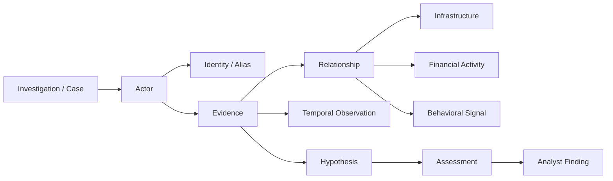

This allows the same underlying records to drive the Command Center,
investigation workspace, network graph, timeline, evidence ledger,
attribution assessment, threat watch, and reports.

------------------------------------------------------------------------

# 3. Product Model

AEGIS is organized around a simple question:

> **What happened, what connects to what, how strong is the evidence,
> what conflicts with the current hypothesis, and what should the
> analyst inspect next?**

The console therefore follows a case-centric hierarchy:

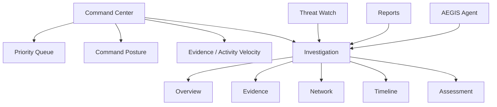

Global navigation is intentionally kept focused. Evidence, graph,
timeline, and attribution are **case capabilities**, not unrelated
global products.

------------------------------------------------------------------------

# 4. Architecture

## 4.1 End-to-End Architecture

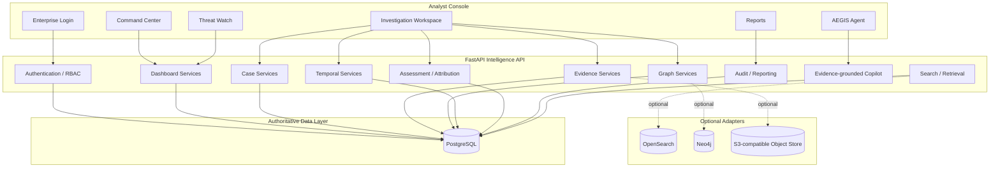

### Architectural rule

**PostgreSQL is the system of record.**

Optional infrastructure adapters improve deployment flexibility or scale
but are not authoritative sources of truth.

------------------------------------------------------------------------

## 4.2 Storage Responsibilities

  Concern          Authoritative         Optional adapter   In-process/default
  ---------------- --------------------- ------------------ ----------------------
  Evidence         PostgreSQL            ---                ---
  Provenance       PostgreSQL            ---                ---
  Audit chain      PostgreSQL            ---                ---
  Retrieval        Evidence table        OpenSearch         PostgreSQL search
  Relationships    PostgreSQL            Neo4j              In-process graph
  Objects          PostgreSQL metadata   S3-compatible      Local/object adapter
  Learned models   PyTorch               ---                NumPy baselines

The free-tier deployment intentionally keeps OpenSearch and Neo4j
optional.

------------------------------------------------------------------------

# 5. Production Request Path

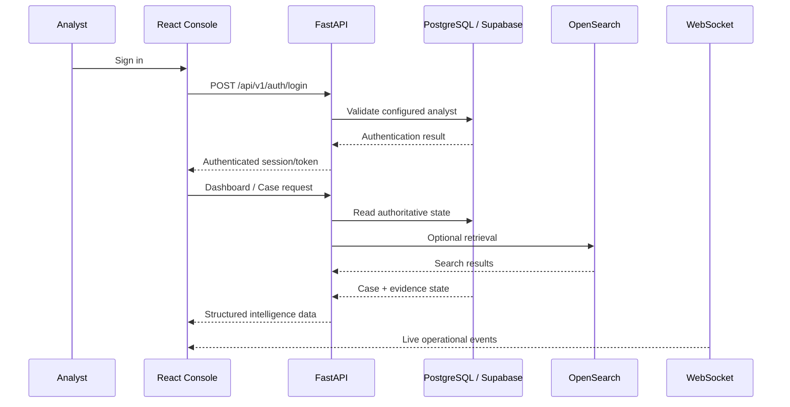

Every frontend API URL is resolved through the configured API base
rather than assuming that the console and API share an origin.

------------------------------------------------------------------------

# 6. Evidence-First Intelligence Pipeline

``` mermaid
flowchart LR
    SRC[Synthetic Sources]
    ING[Collection / Ingestion]
    NORM[Normalization]
    PROV[Provenance + Integrity]
    ENT[Entity Extraction]
    ER[Entity Resolution]
    TG[Temporal Graph]
    FEAT[Multimodal Features]
    MOD[Behavior / Style / Infra / Financial]
    HYP[Hypothesis Generation]
    FUS[Contradiction-aware Fusion]
    GNN[Temporal Heterogeneous GNN]
    ASS[Assessment]
    UI[Analyst Workspace]
    REP[Evidence-grounded Report]

    SRC --> ING --> NORM --> PROV
    PROV --> ENT --> ER --> TG
    PROV --> FEAT
    FEAT --> MOD
    TG --> HYP
    MOD --> HYP
    HYP --> FUS --> GNN --> ASS
    FUS --> ASS
    ASS --> UI --> REP
```

### The rule

Never:

``` text
LLM → guess → graph → dashboard
```

Instead:

``` text
Evidence → provenance → analysis → hypothesis → assessment → analyst finding
```

------------------------------------------------------------------------

# 7. Investigation Workspace

The investigation workspace is the core analyst environment.

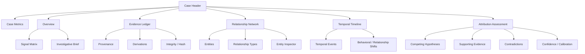

### Case-level analytical dimensions

-   Evidence volume and freshness
-   Entity and relationship growth
-   Behavioral similarity
-   Infrastructure overlap
-   Financial associations
-   Temporal changes
-   Contradictions
-   Hypothesis support
-   Attribution confidence
-   Evidence independence

------------------------------------------------------------------------

# 8. Command Center

The Command Center answers:

> **What requires attention right now, and why?**

It contains:

### Command posture

-   active investigations
-   critical investigations
-   high-priority investigations
-   SLA exposure
-   new evidence
-   unresolved relationships
-   attribution changes

### Prioritization queue

Cases are ordered using operational signals rather than arbitrary visual
ranking.

A queue entry can expose:

-   priority
-   severity
-   evidence velocity
-   relationship growth
-   novel infrastructure
-   contradiction pressure
-   SLA exposure
-   analyst ownership
-   reason for prioritization

### Analytical figures

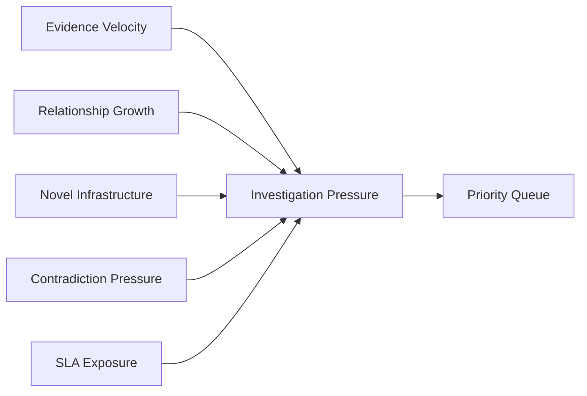

------------------------------------------------------------------------

# 9. Evidence Ledger

Every evidence record is treated as an auditable object.

``` text
Evidence
  ├── source
  ├── timestamp
  ├── collection metadata
  ├── SHA-256 / integrity
  ├── provenance
  ├── parent / derived evidence
  ├── linked entities
  ├── linked hypotheses
  └── analytical claims
```

Evidence is never silently transformed into a finding.

The copilot and reporting layer can only support claims through records
that resolve to the evidence pack.

------------------------------------------------------------------------

# 10. Temporal Intelligence

AEGIS models relationships as time-dependent rather than permanently
true.

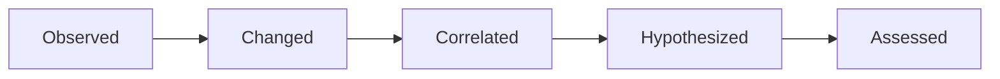

Temporal analysis covers:

-   first observed
-   last observed
-   relationship appearance/disappearance
-   behavioral shifts
-   infrastructure transitions
-   activity bursts
-   change points
-   temporal segments
-   future-node exclusion for point-in-time graph views

------------------------------------------------------------------------

# 11. Attribution and Assessment

AEGIS separates:

**evidence → hypothesis → assessment → finding**

A case can contain multiple competing hypotheses.

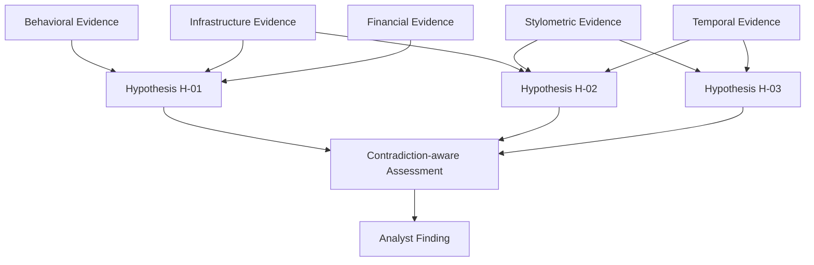

The system preserves uncertainty and explicitly represents
contradictions rather than hiding them inside a single score.

------------------------------------------------------------------------

# 12. Temporal Heterogeneous GNN

The learned graph component uses a temporal heterogeneous architecture
with:

-   type-specific query projections
-   relation-specific key/value projections
-   multi-head attention
-   temporal weighting
-   sinusoidal temporal encoding
-   residual connections
-   GELU activation
-   LayerNorm
-   dropout
-   pair scoring
-   contradiction penalty

The output is a model score, **not automatically a calibrated
probability**.

Training includes:

-   deterministic grouped train/validation/test split
-   AdamW
-   class balancing
-   gradient clipping
-   seeded NumPy/PyTorch execution
-   early stopping

------------------------------------------------------------------------

# 13. Entity Resolution

AEGIS evaluates multiple entity-resolution baselines before learned
graph reasoning.

The workflow is:

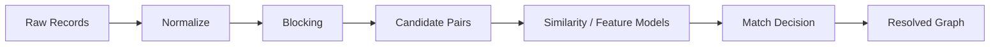

Resolved entities can then participate in:

-   actor trust graphs
-   infrastructure relationships
-   persona linkage
-   temporal transitions
-   hypothesis support

------------------------------------------------------------------------

# 14. Infrastructure Correlation

Infrastructure analysis correlates observations into case-scoped
findings.

The system separates:

-   observation
-   correlation
-   finding

This avoids treating an infrastructure association as guaranteed origin
recovery.

The analysis can surface:

-   domain relationships
-   IP observations
-   hosting relationships
-   infrastructure reuse
-   temporal overlap
-   supporting evidence

------------------------------------------------------------------------

# 15. Behavioral and Stylometric Signals

The multimodal layer can incorporate:

-   behavioral patterns
-   language/style signals
-   activity timing
-   infrastructure behavior
-   financial patterns
-   temporal changes

These signals are evidence modalities, not standalone proof.

------------------------------------------------------------------------

# 16. Financial Graph

Financial relationships are represented as graph evidence rather than
isolated transactions.

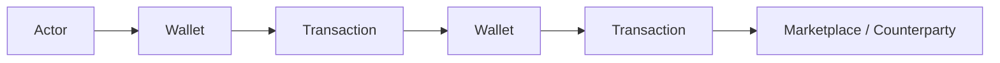

Financial links can contribute to competing hypotheses while retaining
their provenance and independence metadata.

------------------------------------------------------------------------

# 17. Persona Linkage

Persona analysis connects potentially related identities while keeping
adjudication separate from automatic inference.

``` text
Candidate linkage
       ↓
Supporting evidence
       ↓
Contradicting evidence
       ↓
Analyst adjudication
       ↓
Accepted / rejected / unresolved
```

------------------------------------------------------------------------

# 18. Analyst Copilot

The AEGIS Agent is available across the console.

It is intentionally **evidence-grounded and deterministic** in the
current implementation.

Supported intent classes include:

-   evidence search
-   graph query
-   actor profile
-   timeline
-   assessment
-   hypothesis comparison
-   report brief

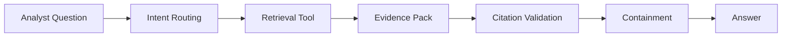

Retrieved evidence is treated as untrusted data.

The system:

-   separates platform instructions from retrieved data
-   detects prompt-injection indicators
-   prevents retrieved text from becoming instructions
-   validates citations
-   drops unsupported/fabricated citations
-   preserves uncertainty

There is currently no LLM in the answer path.

------------------------------------------------------------------------

# 19. Threat Watch

Threat Watch is the live operational stream.

Typical event classes include:

-   new evidence
-   relationship changes
-   attribution changes
-   case activity
-   infrastructure correlations
-   investigation status changes

The WebSocket endpoint is:

``` text
/api/v1/live
```

The console also has a REST fallback so the Command Center remains
usable when the live socket is unavailable.

------------------------------------------------------------------------

# 20. Reporting

Reports are case-scoped and evidence-grounded.

Supported outputs include:

-   investigative briefs
-   attribution assessments
-   evidence appendices
-   structured exports
-   STIX-oriented reporting workflows
-   PDF output when the reporting extra is installed

The reporting chain is:

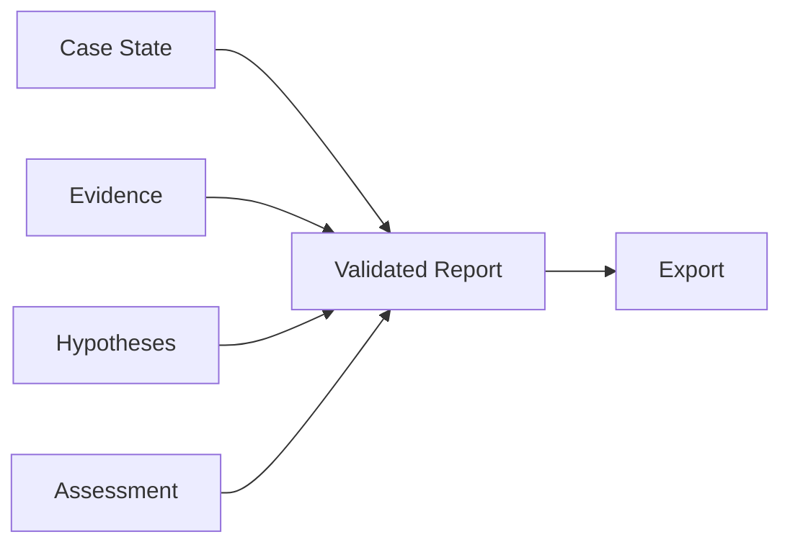

------------------------------------------------------------------------

# 21. Trust Boundaries and Security

AEGIS treats collected content as untrusted.

### Evidence trust boundary

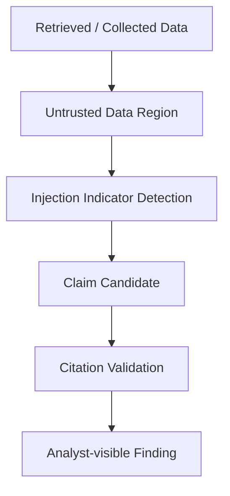

### Audit integrity

Every mutation is audited in the same transaction as the change.

The audit chain is hash-linked and can be verified through:

``` text
GET /api/v1/admin/audit/verify
```

------------------------------------------------------------------------

# 22. API Surface

The API currently spans approximately 75 endpoints across 16 areas.

  -----------------------------------------------------------------------
  Area                                Coverage
  ----------------------------------- -----------------------------------
  Auth                                login, me

  Command Center                      summary, cases, activity

  Cases                               CRUD, workspace, graph, hypotheses,
                                      timeline, signals, metrics,
                                      evidence, activity, notes, temporal
                                      analysis, reports

  Actors                              registry, graph, links,
                                      adjudication, temporal transitions,
                                      behavior, export

  Infrastructure                      summary, findings, matches,
                                      observations, correlation, export

  Personas                            linkages, adjudication, summary,
                                      export

  Collection                          status, sources, jobs, run, export

  Copilot                             query

  Cross-case search                   search

  Threat Watch                        events + WebSocket

  Evidence                            create, read, provenance

  Administration                      team, audit, verification, system

  Registry                            models

  Synthetic analysis                  analysis endpoint

  Health / metrics                    service health and telemetry
  -----------------------------------------------------------------------

All protected routes require authentication except the explicitly public
health/documentation surfaces.

------------------------------------------------------------------------

# 23. Deployment Architecture

The demonstration deployment uses three primary services:

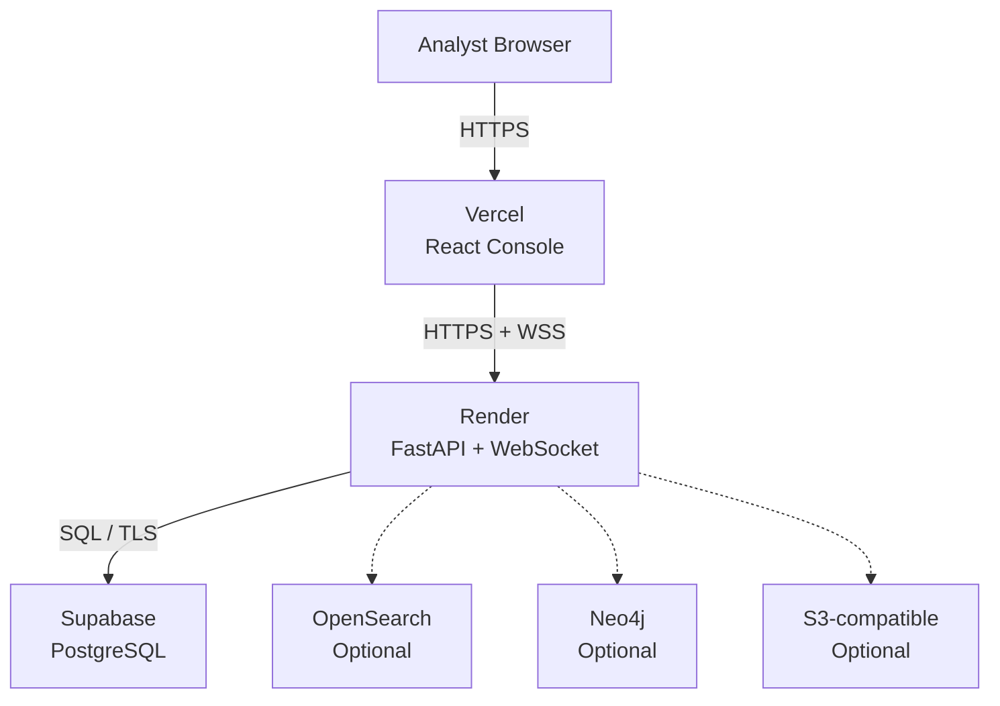

### Deployment components

  Service                     Responsibility
  --------------------------- ----------------------------
  **Vercel**                  React console
  **Render**                  FastAPI + WebSocket
  **Supabase**                Managed PostgreSQL
  **OpenSearch**              Optional retrieval adapter
  **Neo4j**                   Optional graph adapter
  **S3-compatible storage**   Optional object storage

OpenSearch and Neo4j are not required for the core free-tier deployment.

------------------------------------------------------------------------

# 24. Local Development

## Requirements

-   Python 3.12+
-   `uv`
-   Node.js / npm
-   Docker
-   PostgreSQL 17 or Docker Compose
-   Optional OpenSearch 2.19

## Setup

``` bash
cp .env.example .env
uv sync --extra dev
make infra-up
make migrate
make demo-reset
make run
make frontend-dev
```

For OpenSearch-backed retrieval:

``` bash
make demo-reset -- --index
```

or seed with the project's seeding script and pass the indexing option
after starting OpenSearch.

------------------------------------------------------------------------

# 25. Configuration

Important environment variables:

  Variable                    Purpose
  --------------------------- ------------------------------------
  `AEGIS_DATABASE_URL`        PostgreSQL DSN
  `AEGIS_AUTH_EMAIL`          Demo/configured analyst email
  `AEGIS_AUTH_PASSWORD`       Demo/configured analyst password
  `AEGIS_AUTH_SECRET`         Token signing secret
  `AEGIS_AUTH_DISPLAY_NAME`   Analyst display name
  `AEGIS_AUTH_ROLE`           Analyst role
  `AEGIS_AUTH_ORGANIZATION`   Organization displayed in console
  `AEGIS_OPENSEARCH_URL`      Optional OpenSearch endpoint
  `AEGIS_CORS_ORIGINS`        Explicit frontend origin allowlist

The demo credentials shown at the top of this README are for the public
synthetic walkthrough only.

------------------------------------------------------------------------

# 26. Optional Dependency Groups

  Extra         Purpose
  ------------- ----------------------------------
  `dev`         pytest, mypy, ruff, HTTP testing
  `search`      OpenSearch client
  `s3`          S3-compatible object storage
  `ml`          PyTorch, XGBoost, scikit-learn
  `report`      PDF reporting
  `telemetry`   OpenTelemetry

Example:

``` bash
uv sync --extra dev --extra search --extra report --extra telemetry
```

------------------------------------------------------------------------

# 27. Quality Gates

``` bash
make lint
make typecheck
make schema-check
make security-scan
make test
```

The project also maintains:

-   strict Python typing
-   strict TypeScript
-   migration checks
-   schema validation
-   security scanning
-   frontend build validation
-   integration tests against PostgreSQL
-   browser E2E coverage
-   accessibility auditing

The CI pipeline covers backend, migrations, integration, frontend,
deployment configuration, schema validation, package build, and
security.

------------------------------------------------------------------------

# 28. Scope and Safety

AEGIS is intentionally synthetic-first.

### In scope

-   controlled synthetic intelligence environments
-   evidence provenance
-   entity resolution
-   temporal analysis
-   relationship analysis
-   infrastructure correlation
-   financial graph modeling
-   persona linkage
-   attribution hypothesis evaluation
-   analyst decision support
-   defensive security research

### Out of scope

-   defeating Tor cryptography
-   unauthorized exploitation
-   credential attacks
-   access-control bypass
-   intrusive deanonymization
-   offensive automation
-   collection against live targets

Infrastructure associations are treated as **correlations and
indicators**, not guaranteed origin recovery.

------------------------------------------------------------------------

# 29. What Is Real vs Synthetic

## Real and exercised

-   evidence ledger
-   provenance and derivations
-   hash-linked audit chain
-   canonical schemas
-   ontology
-   entity-resolution baselines
-   temporal graph
-   change detection
-   infrastructure correlation
-   persona linkage
-   actor registry and trust graph
-   collection orchestration framework
-   retrieval/search
-   evidence-grounded copilot
-   case workflows
-   reporting/export pipeline
-   analyst console

## Deliberately synthetic

-   actors
-   aliases
-   wallets
-   marketplaces
-   domains
-   infrastructure
-   network relationships
-   collected evidence
-   investigations in the demo world

## Known limitations

-   ingestion is synthetic-only
-   no live-target collector is included
-   the current copilot is deterministic rather than an LLM
-   report generation is currently structured/brief-oriented rather than
    narrative generation
-   copilot conversations are currently single-exchange
-   optional OpenSearch / Neo4j / S3 adapters are thin integration
    layers rather than mandatory production dependencies

------------------------------------------------------------------------

# 30. Research and Implementation Lineage

The implementation is organized into progressive phases:

``` mermaid
flowchart LR
    P1[Foundation]
    P2[Evidence + Provenance]
    P3[Entity + Temporal Graph]
    P4[Resolution + Retrieval]
    P5[Stylometry + Behavior]
    P6[Infrastructure + Financial]
    P7[Attribution]
    P8[Contradiction Fusion]
    P9[Temporal GNN]
    P10[Adversarial Benchmark]
    P11[Analyst Copilot]
    P12[Console + Reporting]
    P13[Hardening + MLOps]

    P1 --> P2 --> P3 --> P4 --> P5 --> P6 --> P7
    P7 --> P8 --> P9 --> P10 --> P11 --> P12 --> P13
```

Relevant architecture and research documents:

  ---------------------------------------------------------------------------------
  Document                                      Purpose
  --------------------------------------------- -----------------------------------
  `docs/architecture.md`                        Logical architecture, storage
                                                responsibilities, deployment
                                                topology

  `docs/adr/`                                   Architectural decision records

  `docs/phase-16-onward-status.md`              Completion matrix and explicit gaps

  `docs/threat-model.md`                        Threat model and abuse cases

  `docs/data-source-policy.md`                  Data-source and synthetic-use
                                                policy

  `docs/phase-19-temporal-gnn.md`               Temporal heterogeneous GNN

  `docs/local-operations.md`                    Local operation

  `DEPLOY.md`                                   Deployment instructions

  `AEGIS_Step_by_Step_Implementation_Plan.md`   Full implementation phase plan
  ---------------------------------------------------------------------------------

------------------------------------------------------------------------

# 31. Repository Structure

``` text
DarkWeb_SIH26151/
│
├── apps/
│   └── frontend/                 # React analyst console
│
├── src/aegis/
│   ├── api/                      # FastAPI routes
│   ├── auth/                     # Authentication
│   ├── cases/                    # Case workflows
│   ├── copilot/                  # Evidence-grounded analyst agent
│   ├── db/                       # Persistence / audit
│   ├── evidence/                 # Evidence ledger
│   ├── graph/                    # Graph domain
│   ├── infrastructure/           # Infrastructure analysis
│   ├── personas/                 # Persona linkage
│   ├── search/                   # Retrieval adapters
│   ├── synthetic/                # Controlled demo world
│   ├── temporal/                 # Temporal analysis
│   └── ...
│
├── scripts/
│   └── seed_demo_data.py         # Synthetic intelligence world
│
├── alembic/
│   └── versions/                 # Authoritative schema history
│
├── tests/
├── docs/
├── docker-compose.yml
├── DEPLOY.md
└── README.md
```

------------------------------------------------------------------------

# 32. Design Principles

### Evidence before inference

A model may propose. Evidence must support.

### Provenance before convenience

Every important analytical object should be traceable.

### Time matters

Relationships can change, disappear, or become relevant only within a
specific window.

### Contradictions are first-class

Conflicting evidence is surfaced rather than silently averaged away.

### Analyst remains accountable

The system assists investigation; it does not turn a model score into an
autonomous finding.

### Synthetic-first development

The platform can be developed, benchmarked, demonstrated, and tested
without operating against live targets.

### Production-oriented architecture

The system of record, API boundaries, adapters, audit model,
frontend/backend separation, and deployment topology are designed so the
synthetic demonstration can evolve without rewriting the analytical
core.

------------------------------------------------------------------------

## AEGIS in one diagram

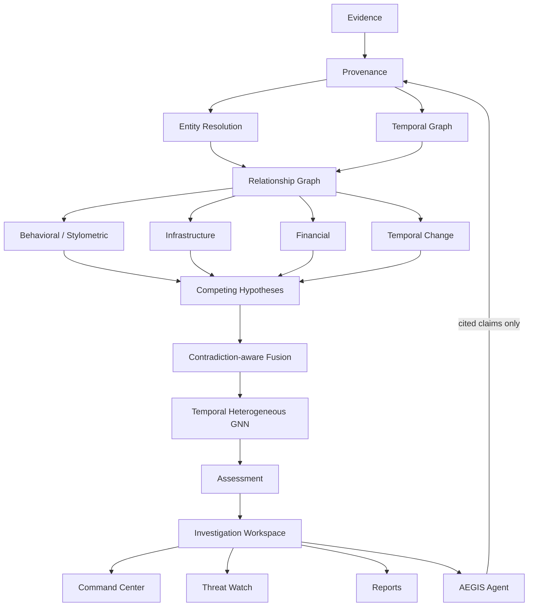

------------------------------------------------------------------------

## 👤 Project Lead

**Mehar Kapoor**  
B.Tech — Electronics & Communication Engineering (AI)  
Indira Gandhi Delhi Technical University for Women (IGDTUW)

**AEGIS — Attribution & Evidence Graph Intelligence System**

<p align="center">
  Built with an evidence-first approach for responsible intelligence research.
</p>
